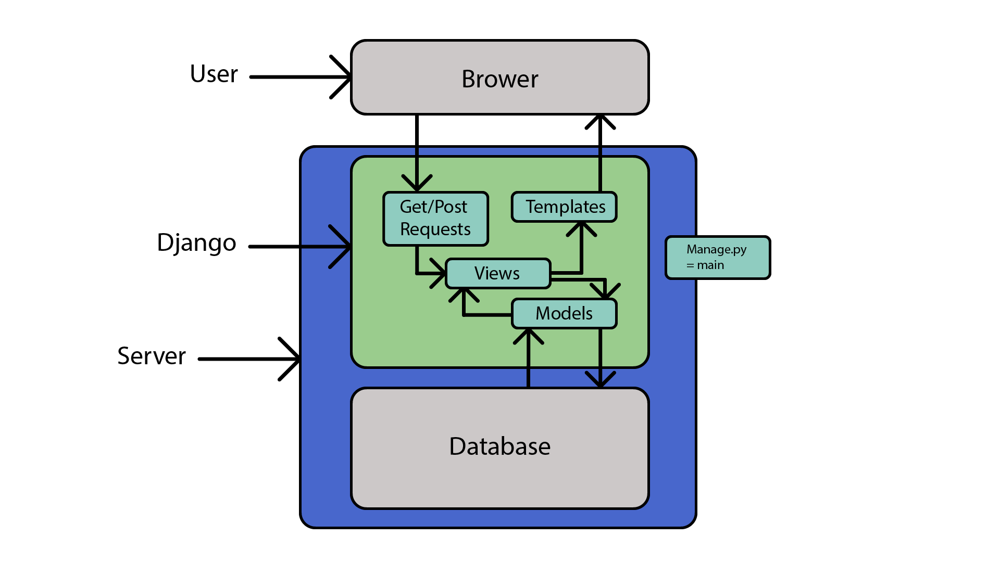

# Django Project

## About
This is my second Django project transferred on to the second, school account and is a login app.
It is also being expanded to include a shopping cart option.

## How to use
To start, install the required packages using the requirement.txt
This step will require the [virtual ven module](https://docs.python.org/3/library/venv.html) (this might require admin access)

This can be done by entering in

    pip install -r requirements.txt
into powershell or terminal

Afterwards, move into the andrew_li_django_website directory and enter

    python manage.py runserver --settings=andrew_site.settings.dev
if you are on Windows

OR

    python3 manage.py runserver --settings=andrew_site.settings.dev
if you are on Mac or Linux

If it is a production environment, use **prod** instead of **dev** in the end condition

## Depenancies

This project uses all the modules in the requirements.txt file
This includes:
 * argon2 v19.1.0
 * Django v2.1.7
 * django-svg-templatetag v1.0.1
 * django-crispy-forms v1.7.2
 * django-recaptcha v2.0.4
 * Pillow v6.0.0

## Simple Rundown of Django

 ** using SQLite3 database

## Reuse
This code is under MIT licence.
